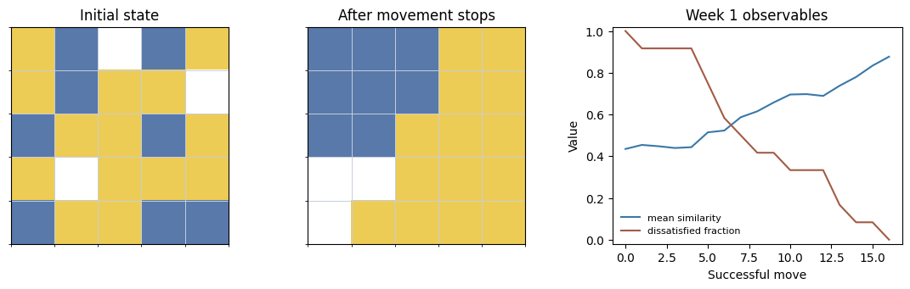
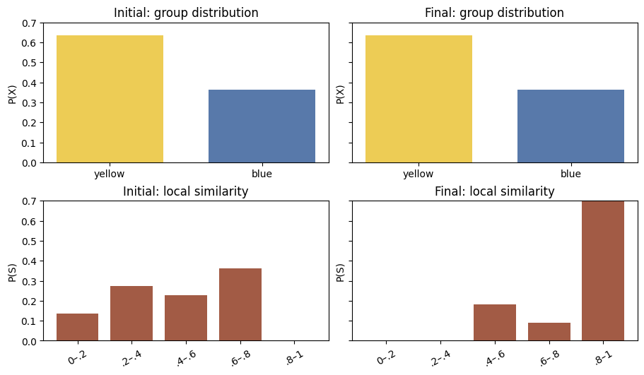
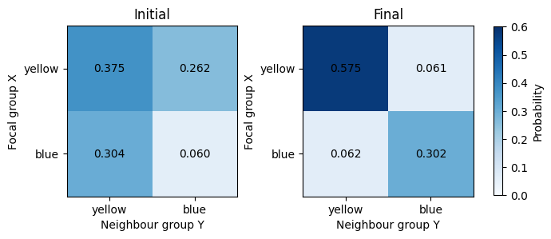
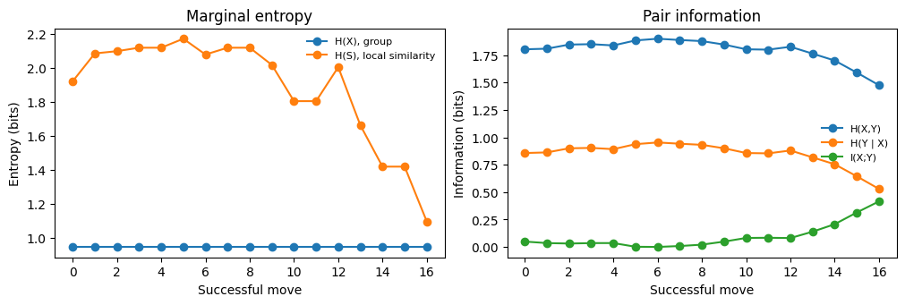
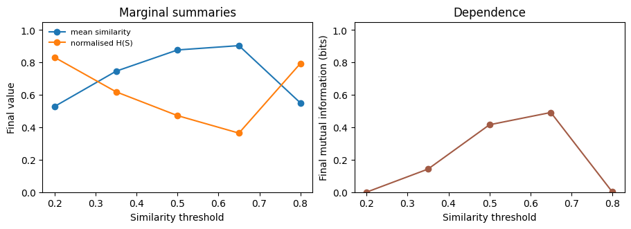
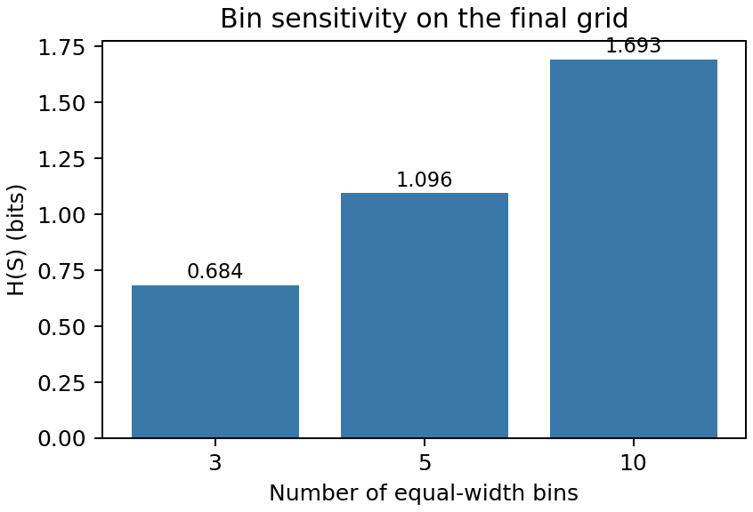
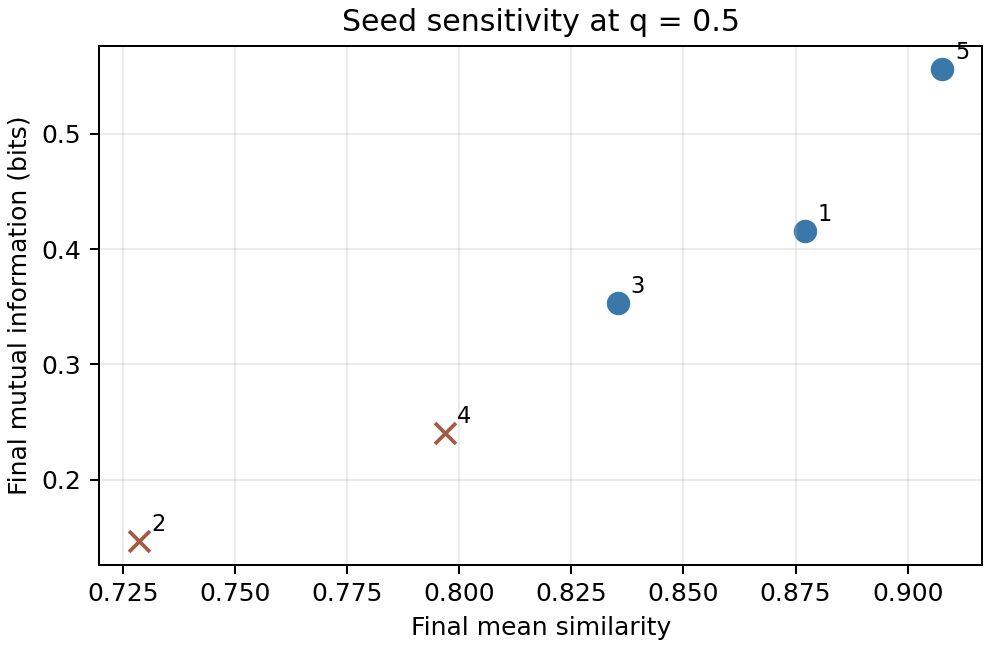

# Week 9 workshop · instructor guide

The notebook uses the Week 1 seeded 5 × 5 Schelling run. The expected run has 16 successful moves and reaches a stopped state. The figures below are the outputs from the workshop code.

## 1. Returning to the Week 1 model

Expected output:

```text
Recorded 16 successful moves.
Mean similarity ratio: 0.435 → 0.877
Dissatisfied agents: 12 → 0
```

The final grid is the stopped state for this seed and threshold. Group counts and vacancies are preserved; only locations change.



Useful checks:

```python
assert len(frames) - 1 == 16
assert dissatisfied_count[-1] == 0
assert np.isclose(msr[0], 0.435, atol=1e-3)
assert np.isclose(msr[-1], 0.877, atol=1e-3)
```

## 2. Entropy of one variable

Expected table:

```text
state                 H(X)      H(S)      mean S
initial             0.946     1.920     0.435
final               0.946     1.096     0.877
```

Answers:

1. $H(X)$ stays fixed because relocation preserves the numbers of yellow and blue agents.
2. $H(S)$ captures how the local-similarity values are distributed across the five bins. The mean gives only their average. Segregation raises the mean while concentrating the distribution, so $H(S)$ falls.
3. The value depends on the five equal-width bins, the Moore neighbourhood, exclusion of empty sites, and pooling local values across occupied agents. Changing any of these changes the measured variable.



## 3. Joint, conditional and mutual information

The printed table and coloured squares are the same joint distribution. Rows are focal group $X$, columns are neighbour group $Y$, and each cell is $P(X=x,Y=y)$.

Expected summaries:

| State | $H(X)$ | $H(Y)$ | $H(X,Y)$ | $H(Y\mid X)$ | $I(X;Y)$ |
|---|---:|---:|---:|---:|---:|
| Initial | 0.946 | 0.906 | 1.802 | 0.857 | 0.049 |
| Final | 0.946 | 0.945 | 1.475 | 0.530 | 0.416 |

Answers:

1. The marginal group probabilities remain almost unchanged. Segregation changes the relationship between neighbouring groups.
2. $H(Y\mid X)$ is lower than $H(Y)$ in both states. Knowing the focal group makes the neighbour more predictable.
3. Initially, $0.906-0.857=0.049$ bits. Finally, $0.945-0.530\approx0.416$ bits. The increase shows that relocation creates stronger local dependence.
4. $H(X)$ depends on group counts. $I(X;Y)$ depends on adjacency, so it can change while the marginal stays fixed.

Checks:

```python
for grid in (initial, final):
    joint, (hx, hy, hxy, hy_x, mi) = pair_summary(grid)
    assert np.isclose(hxy, hx + hy_x)
    assert np.isclose(mi, hy - hy_x)
    assert np.isclose(joint.sum(), 1)
```



## 4. Entropy through the run

The expected figure shows $H(X)$ nearly flat, $H(S)$ declining, $H(Y\mid X)$ and $H(X,Y)$ declining, and $I(X;Y)$ rising. Small reversals between moves are sampling fluctuations; interpret the overall change and the stopped endpoint.

The identities should hold at every recorded step:

```python
hy = np.asarray([pair_summary(grid)[1][1] for grid in frames])
assert np.allclose(
    time_measures["H(X,Y)"],
    np.asarray(time_measures["H(X)"]) + np.asarray(time_measures["H(Y | X)"]),
)
assert np.allclose(
    time_measures["I(X;Y)"],
    hy - np.asarray(time_measures["H(Y | X)" ]),
)
```



## 5. Varying the similarity threshold

Expected output for the fixed initial grid:

```text
threshold   moves   settled    MSR    H(S)/max   I(X;Y)
    0.20       4   True      0.529      0.831      0.000
    0.35      34   True      0.746      0.619      0.142
    0.50      16   True      0.877      0.472      0.416
    0.65     179   True      0.904      0.364      0.491
    0.80     200   False     0.551      0.793      0.002
```

The threshold changes the relocation rule. Larger thresholds generally produce stronger segregation and larger final dependence, but the $q=0.80$ run has not settled by the 200-move limit. Its endpoint is therefore a truncated trajectory, not evidence for a low-information steady state.

Ask students to report `moves` and `settled` with every endpoint comparison.



## 6. Changing the bin size

Expected output for the final grid:

```text
bins    H(S)
   3   0.684 bits
   5   1.096 bits
  10   1.693 bits
```

The local values have not changed. The observation has changed because the binning rule changed. Entropies with different bin counts are not like-for-like comparisons; keep the binning rule fixed when comparing time points or parameter values.

Suggested check and figure:

```python
bins = (3, 5, 10)
values = [entropy(similarity_probabilities(final, n)) for n in bins]
plt.bar([str(n) for n in bins], values, color="#3978A8")
plt.xlabel("Number of equal-width bins")
plt.ylabel("H(S) (bits)")
plt.title("Bin sensitivity on the final grid")
plt.show()
```



## 7. A worked extension: sensitivity to random seed

Use this as the model answer if students choose a seed comparison. It keeps the threshold, grid size, neighbourhood and sampling rule fixed.

```python
seed_results = []
for seed in range(1, 6):
    seed_initial = initialise(seed)
    seed_frames, _, seed_dissatisfied = run_schelling(
        seed_initial, seed=seed, threshold=THRESHOLD
    )
    state = seed_frames[-1]
    _, h_s, mean_s = marginal_summary(state)
    _, (_, _, _, _, mi) = pair_summary(state)
    seed_results.append({
        "seed": seed,
        "moves": len(seed_frames) - 1,
        "settled": seed_dissatisfied[-1] == 0,
        "MSR": mean_s,
        "H(S)": h_s,
        "I(X;Y)": mi,
    })

for result in seed_results:
    print(result)
```

The corresponding comparison plot uses final MSR on the horizontal axis and final $I(X;Y)$ on the vertical axis. Mark runs with `settled == False` separately so an unfinished endpoint is visible.

```python
for result in seed_results:
    marker = "o" if result["settled"] else "x"
    colour = "#3978A8" if result["settled"] else "#A25B45"
    plt.scatter(result["MSR"], result["I(X;Y)"], marker=marker, color=colour)
    plt.annotate(str(result["seed"]), (result["MSR"], result["I(X;Y)"]),
                 xytext=(5, 4), textcoords="offset points")
plt.xlabel("Final mean similarity")
plt.ylabel("Final mutual information (bits)")
plt.title("Seed sensitivity at q = 0.5")
plt.show()
```

Expected values (rounded):

| Seed | Moves | Settled | MSR | $H(S)$ | $I(X;Y)$ |
|---:|---:|:---:|---:|---:|---:|
| 1 | 16 | yes | 0.877 | 1.096 | 0.416 |
| 2 | 200 | no | 0.729 | 1.813 | 0.146 |
| 3 | 6 | yes | 0.835 | 1.206 | 0.353 |
| 4 | 200 | no | 0.797 | 1.579 | 0.240 |
| 5 | 16 | yes | 0.908 | 1.054 | 0.556 |



The teaching point is that one run illustrates the mechanism; several runs show variability and whether the stopping rule is being reached. A student using a different comparison should state the changed observation or parameter, keep the other definitions fixed, and show both the code and the resulting figure.

Acceptable predictions for other extensions include:

- changing group balance changes $H(X)$ directly;
- changing neighbourhood radius changes the spatial scale represented by $I(X;Y)$;
- changing grid size changes sampling stability and the range of possible local patterns;
- changing the stopping rule changes whether the endpoint can be interpreted as a settled state.
